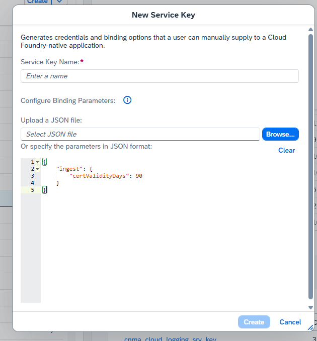
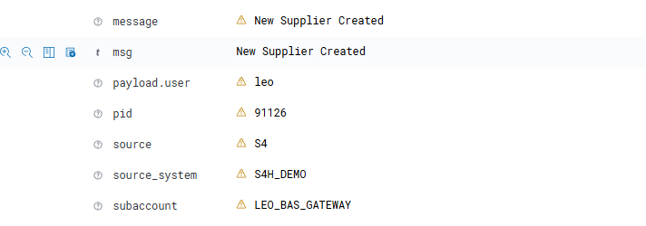
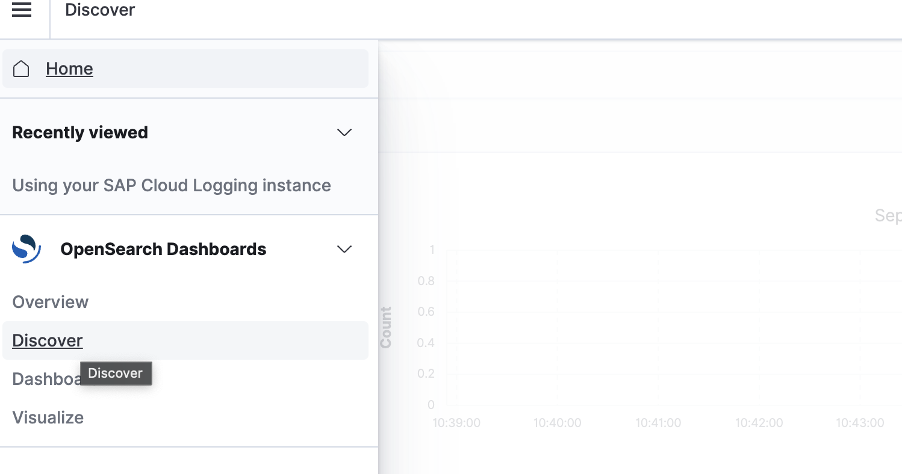
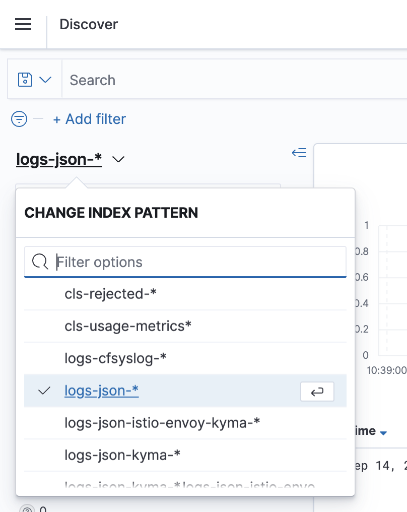

# SAP BTP Cloud Logging Client

[](https://www.npmjs.com/package/sap-btp-cloud-logging-client) [](https://www.npmjs.com/package/sap-btp-cloud-logging-client)

A Package support using cloud logging multiple-sub accounts with 1 Cloud Logging instance
Example: Your System Landscape with 3 global account (2 CPEA, 1 PAYG)
```
├── Global CPEA Subcribe
│   ├── Sub Account A Subcribed Cloud Logging
│   ├── Sub Account B using Cloud Logging via sap-btp-cloud-logging-client
├── Global CPEA using/
│   └── Sub Account C using Cloud Logging via sap-btp-cloud-logging-client
├── Global PAYG/
│   └── Sub Account D using Cloud Logging via sap-btp-cloud-logging-client
```
## Ship by Claude Kit
Ship faster With AI Dev Team
[DISCOUNT 25% - PAY ONE TIME, LIFETIME UPGRADE ](https://claudekit.cc/?ref=VAK416FU)


## Documentation
- [**Architecture & Design**](docs/Architecture.md) - Internal components and multi-subaccount patterns.
- [**Detailed Usage Guide**](docs/Usage.md) - Configuration references and advanced features.
- [**Release Notes**](docs/Release.md) - Release process.

## Project Structure
```
sap-btp-cloud-logging-client/
├── package.json
├── README.md
├── LICENSE
├── index.js
├── lib/
│   ├── CloudLoggingService.js
│   ├── ConfigManager.js
│   ├── LogFormatter.js
│   ├── Logger.js              ← console fallback + sanitize (v1.0.8+)
│   ├── LogUtils.js            ← domain logger singleton (v1.0.8+)
│   ├── Transport.js
│   ├── Middleware.js
│   ├── WinstonTransport.js
│   └── JSONUtils.js
├── types/
│   └── index.d.ts
├── examples/
│   ├── basic-usage.js
│   ├── express-middleware.js
│   ├── advanced-usage.js
│   ├── winston-integration.js
│   ├── BTPCloudLogger.ts
│   └── utils/
│       ├── LogUtils.ts
│       └── LogUtils.js
├── docs/
│   ├── Architecture.md
│   ├── Usage.md
│   └── Release.md
└── test/
    └── CloudLoggingService.test.js
```

## Usage

### Install package
```
npm install sap-btp-cloud-logging-client
```
### Env config
All required config bellow can get from Service: Cloud Logging instance Service Keys
- v1.0.0 it's support only this way
```
# Required
BTP_LOGGING_INGEST_ENDPOINT=https://ingest-sf-xxx.cls-16.cloud.logs.services.eu10.hana.ondemand.com
BTP_LOGGING_USERNAME=your-ignest-username
BTP_LOGGING_PASSWORD=your-ingest-password

# Optional
BTP_SUBACCOUNT_ID=subaccount-id #to determine the logs source
BTP_APPLICATION_NAME=your-app-name #it's based on application
BTP_LOG_LEVEL=INFO # Optional: DEBUG, INFO, WARN, ERROR, FATAL (default: DEBUG)
BTP_LOGGING_MAX_RETRIES=3
BTP_LOGGING_TIMEOUT=5000
```
#### Log Level Filtering
- You can control the verbosity of logs using `BTP_LOG_LEVEL` or `logLevel` in config.
- Levels: `DEBUG` < `INFO` < `WARN` < `ERROR` < `FATAL`
- Example: If `BTP_LOG_LEVEL=WARN`, only `WARN`, `ERROR`, and `FATAL` logs will be sent.

- from v1.0.1 support new way using json from service key JSON of Cloud Logging (still auth by basic not mtls way -> then you can remove ```server-ca,ingest-mtls-key,ingest-mtls-cert,client-ca``` we no need it any more just add this for lazy set multiple env prop)
  
Get it from ```SubAccount (Subcribtion Cloug Logging) -> Instance Cloud Logging -> Service Keys (if not exist create new one)```
BTP_LOGGING_SRV_KEY_CRED = {copy all json from Cloud Logging Service Key}

Example: ```BTP_LOGGING_SRV_KEY_CRED ='<json content copy from service key>'```

```
BTP_LOGGING_SRV_KEY_CRED ='{
    "client-ca": "<sensitive>",
    "dashboards-endpoint": "dashboards-sf-61111e58-2a9a-4790-9baf-efe56ec2c871.cls-16.cloud.logs.services.eu10.hana.ondemand.com",
    "dashboards-password": "<sensitive>",
    "dashboards-username": "<sensitive>",
    "ingest-endpoint": "ingest-sf-61111e58-2a9a-4790-9baf-efe56ec2c871.cls-16.cloud.logs.services.eu10.hana.ondemand.com",
    "ingest-mtls-cert": "",
    "ingest-mtls-endpoint": "ingest-mtls-sf-61111e58-2a9a-4790-9baf-efe56ec2c871.cls-16.cloud.logs.services.eu10.hana.ondemand.com",
    "ingest-mtls-key": "",
    "ingest-password": "<sensitive>",
    "ingest-username": "vMSeXiYcYF",
"server-ca":"<sensitive>"
}'
```
### Auth & post log
We'll use username, password from service key for ```basic auth``` for ```mtls``` way seem the key valid max only ```180 days``` we've to create a feature auto create/get new key...etc it complex even we've env ```BTP_LOGGING_SRV_AUTH_TYPE='basic';//allow: basic,mtls``` but not recommend using ```mtls``` this time


### Instance Specify Config

```
const logger = createLogger({
  ingestEndpoint: 'https://ingest-sf-xxx.cls-16.cloud.logs.services.eu10.hana.ondemand.com',
  username: 'your-username',
  password: 'your-password',
  applicationName: 'my-app',
  subaccountId: 'subaccount-b',
  environment: 'production',
  enableSAPFieldMapping: true, // Enable BTP Cloud Logging field mapping
  removeOriginalFieldsAfterMapping: true // Remove original fields after mapping (default: true)
});
```

### BTP Cloud Logging Field Mapping (v1.0.7+)

This library supports automatic field mapping to SAP BTP Cloud Logging standard fields:

#### Default Behavior (Clean Logs)
```javascript
const logger = createLogger({
  applicationName: 'MyApp',
  subaccountId: 'my-subaccount',
  enableSAPFieldMapping: true
  // removeOriginalFieldsAfterMapping: true (default)
});

// Log entry sent to Cloud Logging:
{
  "msg": "User login successful",           // BTP standard field
  "app_name": "MyApp",                    // BTP standard field  
  "organization_name": "my-subaccount",     // BTP standard field
  "level": "INFO",
  "timestamp": "2026-03-05T12:00:00.000Z"
  // Original fields (message, application, subaccount) are removed
}
```

#### Backward Compatibility Mode
```javascript
const logger = createLogger({
  applicationName: 'MyApp',
  subaccountId: 'my-subaccount',
  enableSAPFieldMapping: true,
  removeOriginalFieldsAfterMapping: false // Keep original fields
});

// Log entry sent to Cloud Logging:
{
  "message": "User login successful",        // Original field
  "msg": "User login successful",           // BTP standard field
  "application": "MyApp",                  // Original field
  "app_name": "MyApp",                    // BTP standard field
  "subaccount": "my-subaccount",           // Original field
  "organization_name": "my-subaccount",     // BTP standard field
  "level": "INFO",
  "timestamp": "2026-03-05T12:00:00.000Z"
}
```

#### Field Mapping Table
| Original Field | BTP Standard Field | Description |
|---------------|-------------------|-------------|
| `message` | `msg` | Log message content |
| `application` | `app_name` | Application name |
| `subaccount` | `organization_name` | Subaccount/organization ID |

#### Configuration Options
- **`enableSAPFieldMapping`** (boolean, default: `true`)
  - Enable/disable BTP Cloud Logging field mapping
- **`removeOriginalFieldsAfterMapping`** (boolean, default: `true`)
  - Remove original fields after mapping to prevent duplicates
  - Set to `false` for backward compatibility

### Implementation
#### Basic
- Javascript
```
const { createLogger } = require('sap-btp-cloud-logging-client');

const logger = createLogger();

logger.info('Hello from BTP Cloud Logging!');
```
- Typescript
```
import { createLogger, middleware as loggingMiddleware } from 'sap-btp-cloud-logging-client';
const logger = createLogger();
logger.info('Hello from BTP Cloud Logging!');
```

---

## Logger & LogUtils (v1.0.8+)

Built-in structured domain logger with console fallback and sensitive data redaction.
**No need to copy LogUtils manually** — it's now bundled in the package.

> **Full example:** [examples/log-utils-built-in-usage.js](examples/log-utils-built-in-usage.js)

### Quick Start

**JavaScript**
```js
const { logUtils, Logger, sanitize } = require('sap-btp-cloud-logging-client');

// Standard
logUtils.info('Application started');
logUtils.error('Order failed', new Error('Timeout'), { orderId: 'ORD-001' });

// API log
logUtils.apiInfo('POST /orders received', { source: 'OrderService', statusCode: 201 });
logUtils.apiError('GET /suppliers failed', new Error('503'), { endpoint: '/suppliers' });

// Event log
logUtils.eventInfo('PurchaseOrder.Created received', { eventType: 'WEBHOOK', entityId: 'PO-001' });

// Base/System log
logUtils.baseInfo('DB migration done', { component: 'MigrationService', action: 'migrate' });
logUtils.baseError('Cache flush failed', new Error('Redis down'), { component: 'CacheService' });
```

**TypeScript**
```typescript
import { logUtils, LogUtils, Logger, sanitize, LogApiOptions } from 'sap-btp-cloud-logging-client';

logUtils.apiInfo('Request received', { source: 'WebhookService', endpoint: '/webhook' });
logUtils.baseError('Startup failed', new Error('Config missing'), { component: 'App' });

// Custom instance (own BTP Cloud Logger init)
const myLogger = new LogUtils();
myLogger.eventInfo('Event processed', { eventName: 'Order.Created', entityId: 'ORD-001' });
```

### Sanitize — Redact Sensitive Fields

```js
const { sanitize } = require('sap-btp-cloud-logging-client');

const safe = sanitize({
    userId: 'u-123',
    password: 'secret',   // → [REDACTED]
    token: 'Bearer xyz',  // → [REDACTED]
    nested: { apikey: 'key' }  // → [REDACTED]
});
```

### Logger — Console Fallback (Direct Use)

```js
const { Logger } = require('sap-btp-cloud-logging-client');

Logger.info('Direct console log');
Logger.error('Startup error', { context: 'init' });
```

### How It Works

```
logUtils.apiInfo(...)
    │
    ├─► BTP Cloud Logger (primary)   — sends to Cloud Logging OpenSearch
    └─► Logger/console (fallback)    — always printed locally
         └─► sanitize()              — redacts tokens/passwords before output
```

- BTP Cloud Logger init retries **3 times** (2s delay) before falling back to console-only
- All metadata is sanitized before logging (passwords, tokens, secrets → `[REDACTED]`)
- `logUtils` is a **singleton** — shared across the app; use `new LogUtils()` for isolated instances
### Middleware Configuration
You can configure the Express middleware to exclude paths or toggle logging:

```javascript
const { createLogger, middleware } = require('sap-btp-cloud-logging-client');
const app = require('express')();
const logger = createLogger();

app.use(middleware(logger, {
  logRequests: true,      // Log incoming requests (default: true)
  logResponses: true,     // Log responses (default: true)
  excludePaths: ['/health', '/metrics', '/readiness'] // Skip logging for these paths
}));
```

#### Add metadata dynamic property
```
const sampleMetadata = {
        source:"S4",
        source_system:"S4H_DEMO",
        payload: {
            user:"leo"
        }
    };
    logger.info(`New Supplier Created`,sampleMetadata);
```
Result

#### Logs Batch 

```
async function batchLogging() {
  const entries = [
    { level: 'INFO', message: 'Batch entry 1', metadata: { batch: 1 } },
    { level: 'INFO', message: 'Batch entry 2', metadata: { batch: 2 } },
    { level: 'WARN', message: 'Batch entry 3', metadata: { batch: 3 } }
  ];

  await logger.logBatch(entries);
}
```
## Dashboard, Discovery, and Property Filtering

### Access the Cloud Logging OpenSearch Dashboard

The dashboard endpoint and credentials are available in the SAP Cloud Logging service key:

```json
{
  "dashboards-endpoint": "dashboards-sf-61111e58-2a9a-4790-9baf-efe56ec2c871.cls-16.cloud.logs.services.eu10.hana.ondemand.com",
  "dashboards-password": "<sensitive>",
  "dashboards-username": "<sensitive>"
}
```

Open the value of `dashboards-endpoint` in a browser and sign in with
`dashboards-username` and `dashboards-password`.

From the left navigation, open **Discover**:



Select the `logs-json-*` index pattern:



You can then search and filter logs by fields such as `app_name`,
`organization_name`, `environment`, `level`, and your custom metadata.

### Custom Properties Are Visible but Cannot Be Filtered

```
Management
  → Dashboards Management
    → Index Patterns
      → logs-json-*
        → Refresh field list
```
A structured property may already be present in the expanded JSON document but
still show a warning such as:

> No cached mapping for this field. Refresh field list from the Management >
> Index Patterns page.

This normally means that the document was ingested successfully, but the
`logs-json-*` index pattern has not refreshed its cached field definitions.

#### Refresh the Index Pattern Field List

In OpenSearch Dashboards, go to:

```text
Dashboards Management
  -> Index Patterns
    -> logs-json-*
      -> Refresh field list
```

After refreshing:

1. Return to **Discover**.
2. Reload the page.
3. Select `logs-json-*` again if necessary.
4. Expand a recent log document and verify that the warning icon is gone.

The exact menu wording may vary slightly between OpenSearch Dashboards
versions.

### Filter Examples

For exact matching on string properties, prefer the `.keyword` field:

```text
app_name.keyword: "sample_integration_srv"
```

```text
environment.keyword: "production"
```

```text
organization_name.keyword: "sample-subaccount"
```

```text
source_system.keyword: "S4H_DEMO"
```

Nested metadata can be filtered by its full path:

```text
payload.user.keyword: "leo"
```

Numeric properties do not normally need `.keyword`:

```text
pid: 226
```

You can also use **Add filter** in Discover and select the field, operator, and
value from the UI.

### Why `.keyword` Is Recommended

OpenSearch commonly exposes string values in two forms:

- `<field>` is usually a `text` field for full-text search.
- `<field>.keyword` is used for exact matching, filtering, sorting, and
  aggregations.

For example:

```text
msg: "destination"
```

is suitable for searching message text, while:

```text
app_name.keyword: "my-app"
```

is better for selecting one exact application.

If a `.keyword` variant is not available, try the original field:

```text
app_name: "my-app"
```

Then inspect the field definition under:

```text
Dashboards Management -> Index Patterns -> logs-json-*
```

Check that the field is:

- **Searchable**
- **Aggregatable** when it must be used in dashboards or aggregations
- Mapped to the expected type, such as `keyword`, `text`, `number`, or `date`

### Diagnose Mapping Conflicts

OpenSearch requires a property to keep a compatible data type across indexes.
For example, avoid sending the same property as both a number and a string:

```javascript
// First log
logger.info('Order created', { entity_id: 123 });

// Later log: avoid changing the same field to a string
logger.info('Order updated', { entity_id: '123' });
```

Also avoid changing a property from a primitive value to an object:

```javascript
// First log
logger.info('Payload received', { payload: 'raw text' });

// Later log: mapping conflict risk
logger.info('Payload received', {
  payload: {
    id: 'PO-001'
  }
});
```

Use different, explicit field names when the values represent different types:

```javascript
logger.info('Payload received', {
  entity_id_number: 123,
  payload_text: 'raw text'
});
```

If you have permission to use **Dev Tools**, inspect field capabilities across
the rollover indexes:

```http
GET logs-json-*/_field_caps?fields=app_name,environment,source_system,payload.*
```

The response shows the detected type of each field and whether it is
searchable or aggregatable. Multiple types for the same property usually
indicate inconsistent data sent by different applications or package versions.

### Recommended Metadata Design

Keep custom metadata predictable and type-safe:

```javascript
logger.info('Retrieving destination', {
  component: 'BTPDestBase',
  operation: 'retrieve_destination',
  destination_name: 'po_odata_dest_cfg',
  source_system: 'S4H_DEMO',
  retry_count: 0,
  success: true
});
```

Recommended practices:

- Keep the same field type across all log messages and application versions.
- Use stable property names instead of generating property names dynamically.
- Do not reuse one field as both a string and an object.
- Avoid overriding standard logging fields through custom metadata.
- Prefer IDs, status values, component names, and operation names as separate
  searchable fields instead of embedding everything inside `msg`.
- Avoid shipping secrets, passwords, tokens, authorization headers, or full
  service-key credentials.
- Use `sanitize()` or the built-in `LogUtils` helpers before logging sensitive
  application objects.

Treat these fields as reserved package or SAP logging fields:

```text
date
timestamp
@timestamp
msg
message
level
app_name
application
organization_name
subaccount
environment
hostname
pid
```

### Event Timestamp Note

The current package examples use `timestamp`. SAP Cloud Logging's JSON ingest
API recognizes `date` as the event-time field used when indexing a document.
When `date` cannot be extracted, Cloud Logging uses the time at which the
payload is parsed.

For a custom formatter or a future package version, a backward-compatible
payload may include both fields:

```json
{
  "date": "2026-07-20T10:24:35.987Z",
  "timestamp": "2026-07-20T10:24:35.987Z",
  "msg": "[BTPDestBase] Retrieving destination",
  "level": "INFO",
  "app_name": "sample_integration_srv",
  "environment": "production",
  "organization_name": "sample-subaccount",
  "destination_name": "po_odata_dest_cfg"
}
```

Do not assume that adding `date` is already supported by every released package
version. Verify the formatter output before depending on this field.

### Troubleshooting Checklist

When a property cannot be filtered:

1. Confirm that the property exists in the expanded JSON document.
2. Confirm that Discover is using `logs-json-*`.
3. Refresh the `logs-json-*` field list.
4. Reload Discover and retry the filter with `<field>.keyword`.
5. Inspect whether the field is searchable and aggregatable.
6. Check `_field_caps` for inconsistent types across indexes.
7. Verify that all applications send the property with the same data type.
8. Use a new field name if an old mapping is already incompatible.

Existing indexed field mappings generally cannot be safely changed in place.
Using a new field name is often the safest application-side solution when old
indexes already contain a conflicting type.

### References

- [SAP Cloud Logging: OpenSearch Dashboards UI](https://help.sap.com/docs/cloud-logging/cloud-logging/opensearch-dashboards-ui)
- [SAP Cloud Logging: Ingest via JSON API Endpoint](https://help.sap.com/docs/cloud-logging/cloud-logging/ingest-via-json-api-endpoint)
- [OpenSearch: Field Capabilities API](https://docs.opensearch.org/latest/api-reference/search-apis/field-caps/)

## Contributors
We want to make contributing to this project as easy and transparent as possible. So, just simple do the change then create PR