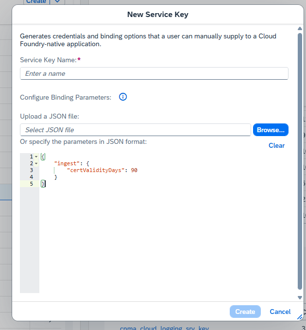

# SAP BTP Cloud Logging Client

[](https://www.npmjs.com/package/sap-btp-cloud-logging-client) [](https://www.npmjs.com/package/sap-btp-cloud-logging-client)

A Package support using cloud logging multiple-sub accounts with 1 Cloud Logging instance
Example: Your System Landscape with 3 global account (2 CPEA, 1 PAYG)
```
├── Global CPEA Subcribe
│   ├── Sub Account A Subcribed Cloud Logging
│   ├── Sub Account B using Cloud Logging via sap-btp-cloud-logging-client
├── Global CPEA using/
│   └── Sub Account C using Cloud Logging via sap-btp-cloud-logging-client
├── Global PAYG/
│   └── Sub Account D using Cloud Logging via sap-btp-cloud-logging-client
```

## Documentation
- [**Architecture & Design**](docs/Architecture.md) - Internal components and multi-subaccount patterns.
- [**Detailed Usage Guide**](docs/Usage.md) - Configuration references and advanced features.
- [**Release Notes**](docs/Release.md) - Release process.

## Project Structure
```
sap-btp-cloud-logging-client/
├── package.json
├── README.md
├── LICENSE
├── index.js
├── lib/
│   ├── CloudLoggingService.js
│   ├── ConfigManager.js
│   ├── LogFormatter.js
│   ├── Transport.js
│   ├── Middleware.js
│   ├── WinstonTransport.js
│   └── JSONUtils.js
├── types/
│   └── index.d.ts
├── examples/
│   ├── basic-usage.js
│   ├── express-middleware.js
│   ├── advanced-usage.js
│   ├── winston-integration.js
│   ├── BTPCloudLogger.ts
│   └── utils/
│       ├── LogUtils.ts
│       └── LogUtils.js
├── docs/
│   ├── Architecture.md
│   ├── Usage.md
│   └── Release.md
└── test/
    └── CloudLoggingService.test.js
```

## Usage

### Install package
```
npm install sap-btp-cloud-logging-client
```
### Env config
All required config bellow can get from Service: Cloud Logging instance Service Keys
- v1.0.0 it's support only this way
```
# Required
BTP_LOGGING_INGEST_ENDPOINT=https://ingest-sf-xxx.cls-16.cloud.logs.services.eu10.hana.ondemand.com
BTP_LOGGING_USERNAME=your-ignest-username
BTP_LOGGING_PASSWORD=your-ingest-password

# Optional
BTP_SUBACCOUNT_ID=subaccount-id #to determine the logs source
BTP_APPLICATION_NAME=your-app-name #it's based on application
BTP_LOG_LEVEL=INFO # Optional: DEBUG, INFO, WARN, ERROR, FATAL (default: DEBUG)
BTP_LOGGING_MAX_RETRIES=3
BTP_LOGGING_TIMEOUT=5000
```
#### Log Level Filtering
- You can control the verbosity of logs using `BTP_LOG_LEVEL` or `logLevel` in config.
- Levels: `DEBUG` < `INFO` < `WARN` < `ERROR` < `FATAL`
- Example: If `BTP_LOG_LEVEL=WARN`, only `WARN`, `ERROR`, and `FATAL` logs will be sent.

- from v1.0.1 support new way using json from service key JSON of Cloud Logging (still auth by basic not mtls way -> then you can remove ```server-ca,ingest-mtls-key,ingest-mtls-cert,client-ca``` we no need it any more just add this for lazy set multiple env prop)
  
Get it from ```SubAccount (Subcribtion Cloug Logging) -> Instance Cloud Logging -> Service Keys (if not exist create new one)```
BTP_LOGGING_SRV_KEY_CRED = {copy all json from Cloud Logging Service Key}

Example: ```BTP_LOGGING_SRV_KEY_CRED ='<json content copy from service key>'```

```
BTP_LOGGING_SRV_KEY_CRED ='{
    "client-ca": "<sensitive>",
    "dashboards-endpoint": "dashboards-sf-61111e58-2a9a-4790-9baf-efe56ec2c871.cls-16.cloud.logs.services.eu10.hana.ondemand.com",
    "dashboards-password": "<sensitive>",
    "dashboards-username": "<sensitive>",
    "ingest-endpoint": "ingest-sf-61111e58-2a9a-4790-9baf-efe56ec2c871.cls-16.cloud.logs.services.eu10.hana.ondemand.com",
    "ingest-mtls-cert": "",
    "ingest-mtls-endpoint": "ingest-mtls-sf-61111e58-2a9a-4790-9baf-efe56ec2c871.cls-16.cloud.logs.services.eu10.hana.ondemand.com",
    "ingest-mtls-key": "",
    "ingest-password": "<sensitive>",
    "ingest-username": "vMSeXiYcYF",
"server-ca":"<sensitive>"
}'
```
### Auth & post log
We'll use username, password from service key for ```basic auth``` for ```mtls``` way seem the key valid max only ```180 days``` we've to create a feature auto create/get new key...etc it complex even we've env ```BTP_LOGGING_SRV_AUTH_TYPE='basic';//allow: basic,mtls``` but not recommend using ```mtls``` this time


### Instance Specify Config

```
const logger = createLogger({
  ingestEndpoint: 'https://ingest-sf-xxx.cls-16.cloud.logs.services.eu10.hana.ondemand.com',
  username: 'your-username',
  password: 'your-password',
  applicationName: 'my-app',
  subaccountId: 'subaccount-b',
  environment: 'production'
});
```

### Implementation
#### Basic
- Javascript
```
const { createLogger } = require('sap-btp-cloud-logging-client');

const logger = createLogger();

logger.info('Hello from BTP Cloud Logging!');
```
- Typescript
```
import { createLogger, middleware as loggingMiddleware } from 'sap-btp-cloud-logging-client';
const logger = createLogger();
logger.info('Hello from BTP Cloud Logging!');
```
or can create a standard common class (Singleton pattern) for using:
> **Check full example code at:** [examples/utils/LogUtils.ts](examples/utils/LogUtils.ts)

```typescript
import { LogUtils }  from './utils/LogUtils';

// Get instance (Singleton)
const logger = LogUtils.getInstance();

// Usage
logger.info('System initialized');

// API Logging
logger.apiInfo('User login', {
    source: 'AuthService',
    userId: 'user-123',
    statusCode: 200
});

// Scheduler Logging
logger.schedulerInfo('Daily sync started', {
    jobName: 'SyncJob',
    jobId: 'job-001'
});
```
### Middleware Configuration
You can configure the Express middleware to exclude paths or toggle logging:

```javascript
const { createLogger, middleware } = require('sap-btp-cloud-logging-client');
const app = require('express')();
const logger = createLogger();

app.use(middleware(logger, {
  logRequests: true,      // Log incoming requests (default: true)
  logResponses: true,     // Log responses (default: true)
  excludePaths: ['/health', '/metrics', '/readiness'] // Skip logging for these paths
}));
```

#### Add metadata dynamic property
```
const sampleMetadata = {
        source:"S4",
        source_system:"S4H_DEMO",
        payload: {
            user:"leo"
        }
    };
    logger.info(`New Supplier Created`,sampleMetadata);
```
Result

#### Logs Batch 

```
async function batchLogging() {
  const entries = [
    { level: 'INFO', message: 'Batch entry 1', metadata: { batch: 1 } },
    { level: 'INFO', message: 'Batch entry 2', metadata: { batch: 2 } },
    { level: 'WARN', message: 'Batch entry 3', metadata: { batch: 3 } }
  ];

  await logger.logBatch(entries);
}
```
### Dashboard & Discovery Logs
#### Cloud Logging Open Search Dashboard
- The url/ credential to access Dashboard inside Service Key you will see

```
"dashboards-endpoint": "dashboards-sf-61111e58-2a9a-4790-9baf-efe56ec2c871.cls-16.cloud.logs.services.eu10.hana.ondemand.com",
"dashboards-password": "<sensitive>",
"dashboards-username": "<sensitive>",
```
Using browser to visit url: ```dashboards-endpoint``` and cred (username, password) above

- Discovery Logs: from the dashboard click to Discovery menu on the left side

Then you should filter by ```logs-json-*```

here you can filter data by sub account, application...etc

## Contributors
We want to make contributing to this project as easy and transparent as possible. So, just simple do the change then create PR