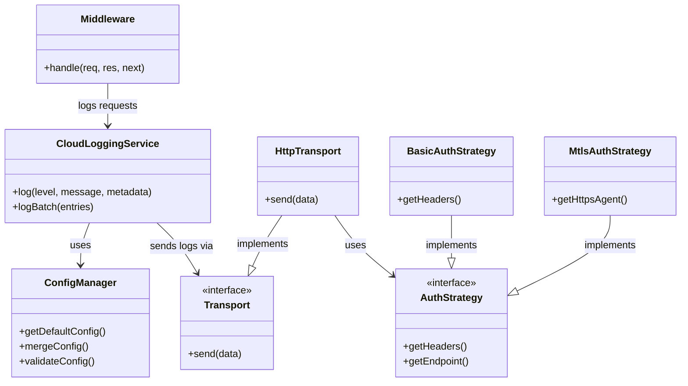
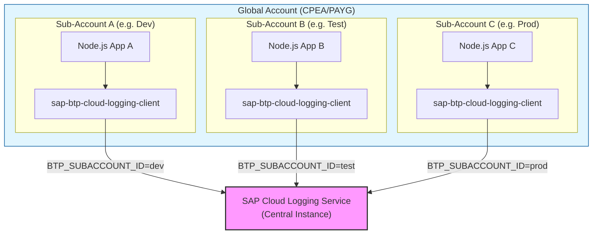

# Architecture

This document describes the internal architecture of the `sap-btp-cloud-logging-client` library and recommended deployment patterns.

## Library Components

The library is designed with a modular architecture to separate concerns:

### Components Description
1.  **CloudLoggingService**: The main entry point. Handles log level filtering, batching, and delegates actual sending to the Transport layer.
2.  **ConfigManager**: Loads configuration from environment variables or Service Keys.
3.  **Transport**: Abstract interface for sending logs. Currently implemented by `HttpTransport` using `axios`.
4.  **AuthStrategy**: Abstraction for authentication (Basic vs mTLS). Decouples auth logic from transport logic.
5.  **Middleware**: Express.js middleware for automatic request/response logging.

## Deployment Architecture

### Multi-Subaccount Logging Pattern
A common pattern is to aggregate logs from multiple sub-accounts into a single Cloud Logging Service instance.

### Key Concept
*   **Central Instance**: One Cloud Logging instance (created in a "Central" subaccount or reused) serves as the log sink.
*   **Differentiation**: Each client application configures `BTP_SUBACCOUNT_ID` layout or `BTP_APPLICATION_NAME` to distinguish its logs in the central dashboard.
*   **Cost Efficiency**: Reduces the need to provision separate Cloud Logging instances for every small sub-account.
