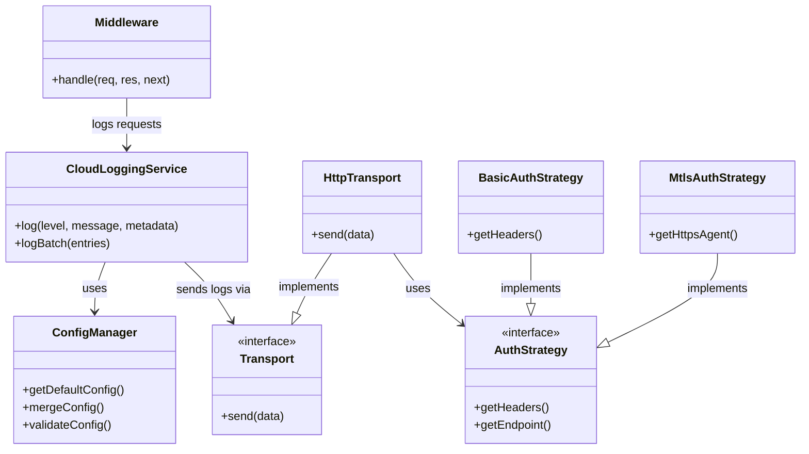
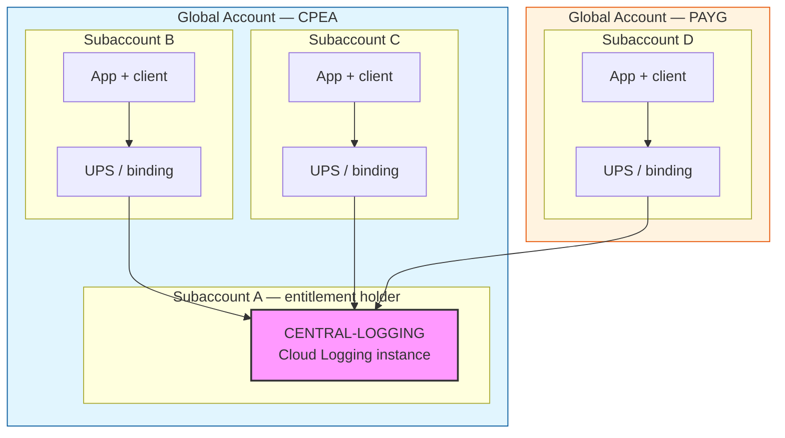

# Architecture

This document describes the internal architecture of the `sap-btp-cloud-logging-client` library and recommended deployment patterns.

## Library Components

The library is designed with a modular architecture to separate concerns:


```mermaid
classDiagram
    class CloudLoggingService {
        +log(level, message, metadata)
        +logBatch(entries)
    }
    class ConfigManager {
        +getDefaultConfig()
        +mergeConfig()
        +validateConfig()
    }
    class Transport {
        <<interface>>
        +send(data)
    }
    class HttpTransport {
        +send(data)
    }
    class AuthStrategy {
        <<interface>>
        +getHeaders()
        +getEndpoint()
    }
    class BasicAuthStrategy {
        +getHeaders()
    }
    class MtlsAuthStrategy {
        +getHttpsAgent()
    }
    class Middleware {
        +handle(req, res, next)
    }

    CloudLoggingService --> ConfigManager : uses
    CloudLoggingService --> Transport : sends logs via
    HttpTransport --|> Transport : implements
    HttpTransport --> AuthStrategy : uses
    BasicAuthStrategy --|> AuthStrategy : implements
    MtlsAuthStrategy --|> AuthStrategy : implements
    Middleware --> CloudLoggingService : logs requests
```

### Components Description
1.  **CloudLoggingService**: The main entry point. Handles log level filtering, batching, and delegates actual sending to the Transport layer.
2.  **ConfigManager**: Loads configuration from environment variables or Service Keys.
3.  **Transport**: Abstract interface for sending logs. Currently implemented by `HttpTransport` using `axios`.
4.  **AuthStrategy**: Abstraction for authentication (Basic vs mTLS). Decouples auth logic from transport logic.
5.  **Middleware**: Express.js middleware for automatic request/response logging.

## Deployment Architecture

### Central Instance Pattern

One subaccount holds the Cloud Logging entitlement and provisions the single instance. Every other application — including applications in a **different global account** — reaches that instance through a user-provided service (UPS) or binding carrying its credentials.

```
Global Account CPEA
│
├── Subaccount A
│   └── Cloud Logging entitlement
│       └── CENTRAL-LOGGING instance
│
├── Subaccount B
│   └── App
│       └── UPS / binding ───────┐
│                                │
└── Subaccount C                 │
    └── App                      ├── OTLP/mTLS
        └── UPS / binding ───────┤
                                 │
Global Account PAYG              │
└── Subaccount D                 │
    └── App                      │
        └── UPS / binding ───────┘
                                 ↓
                         CENTRAL-LOGGING
```


```mermaid
flowchart TB
    subgraph CPEA ["Global Account — CPEA"]
        direction TB
        subgraph SubA ["Subaccount A — entitlement holder"]
            CLS["CENTRAL-LOGGING
            Cloud Logging instance"]
        end
        subgraph SubB ["Subaccount B"]
            AppB["App + client"] --> UpsB["UPS / binding"]
        end
        subgraph SubC ["Subaccount C"]
            AppC["App + client"] --> UpsC["UPS / binding"]
        end
    end

    subgraph PAYG ["Global Account — PAYG"]
        subgraph SubD ["Subaccount D"]
            AppD["App + client"] --> UpsD["UPS / binding"]
        end
    end

    UpsB --> CLS
    UpsC --> CLS
    UpsD --> CLS

    style CLS fill:#f9f,stroke:#333,stroke-width:2px
    style CPEA fill:#e1f5fe,stroke:#01579b
    style PAYG fill:#fff3e0,stroke:#e65100
```

### Why this works across global accounts

The boundary that matters is the **instance**, not the global account. An application never resolves the logging instance from its own platform context — the endpoint and credentials arrive in the UPS, so Subaccount D under PAYG ships to an instance provisioned under CPEA by exactly the same mechanism as Subaccount B next door. Nothing in this client reads the global account.

The consequence is that **the UPS is the entire trust boundary**. Anything holding those credentials can write to the central index, so treat the UPS as a secret, keep one per consuming application rather than sharing one across a landscape, and remember that rotating the instance's credentials invalidates every UPS at once.

### Telling the sources apart

Once logs land in the central instance there is nothing in the payload that identifies where they came from except what the client puts there. Set both per application:

| Variable | Purpose | Default if unset |
|---|---|---|
| `BTP_SUBACCOUNT_ID` | which subaccount produced the entry | `PAYG_DEVELOPMENT` |
| `BTP_APPLICATION_NAME` | which application produced it | `unknown-app` |

Both defaults are placeholders, not useful values — leaving them unset in a central-instance landscape means several applications collapse into one indistinguishable source. They ship as `organization_name` and `app_name` respectively after field mapping.

### Transport lanes

The diagram's `OTLP/mTLS` label describes the platform-level lane into Cloud Logging. It is worth being exact about which lane **this client** uses, because they are not interchangeable:

| Lane | Endpoint | Used by this client |
|---|---|---|
| HTTPS JSON ingest, basic auth | `BTP_LOGGING_INGEST_ENDPOINT` + `BTP_LOGGING_USERNAME` / `BTP_LOGGING_PASSWORD` | **yes — the default**, `HttpTransport` POSTs JSON via axios |
| HTTPS JSON ingest, mTLS | `ingestMtlsEndpoint` + `clientCert` / `clientKey` / `serverCa`, with `authType: 'mtls'` | yes, via `MtlsAuthStrategy` |
| OTLP (OpenTelemetry Protocol) | the instance's OTLP endpoint | **no** — not implemented |

If the central instance is to be fed over OTLP, that is a different ingest path and a different component; this client would need an OTLP exporter rather than a configuration change. Both the Node and Java packages currently ship over the HTTPS JSON ingest lane, so a landscape standardising on OTLP needs that decision taken before either is rolled out.

### Cost note

One instance serves the whole landscape, which is the point of the pattern — but it also means one ingest quota and one retention budget shared by every application. A single noisy application degrades logging for all of them, and on a shared instance size-based curation evicts other applications' data first. Rate limiting is tracked as finding B2 in the hardening plan and is not implemented yet.
