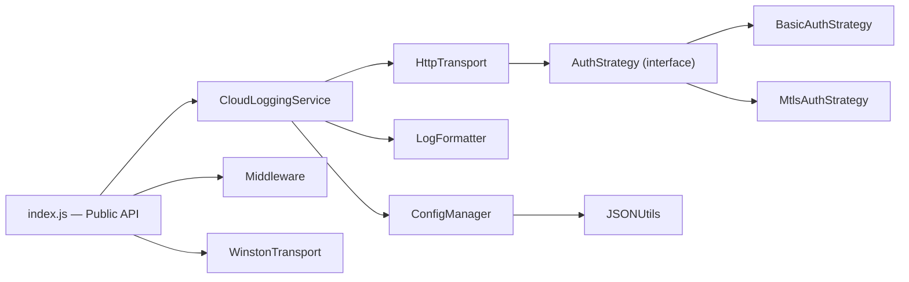

# Code Review: sap-btp-cloud-logging-client (Post-Refactor)

**Date**: 2026-02-10  
**Version**: v1.0.3  
**Scope**: `lib/`, `index.js`, `types/index.d.ts`  
**Status**: ✅ All previous issues resolved — Clean

---

## Architecture



## Design Patterns Applied

| Pattern | Where | Principle |
|---------|-------|-----------|
| **Strategy** | `AuthStrategy` → `BasicAuth` / `MtlsAuth` | OCP, LSP |
| **Factory** | `createAuthStrategy()` | OCP |
| **Template Method** | `Transport.send()` abstract base | OCP, DIP |
| **Facade** | `index.js` hides internal classes | ISP |
| **Singleton (example)** | `LogUtils.ts` in examples | SRP |

## SOLID Scorecard

| Principle | Score | Evidence |
|-----------|-------|----------|
| **S** — Single Responsibility | ⭐⭐⭐⭐⭐ | Each class owns one concern: Config → `ConfigManager`, Format → `LogFormatter`, Transport → `HttpTransport`, Orchestration → `CloudLoggingService` |
| **O** — Open/Closed | ⭐⭐⭐⭐⭐ | New auth types only need a new `AuthStrategy` subclass + factory update. No service modification needed |
| **L** — Liskov Substitution | ⭐⭐⭐⭐ | `BasicAuth` and `MtlsAuth` are proper drop-in substitutes for `AuthStrategy` |
| **I** — Interface Segregation | ⭐⭐⭐⭐ | Small focused interfaces: `Transport`, `AuthStrategy`, `MiddlewareOptions` |
| **D** — Dependency Inversion | ⭐⭐⭐⭐ | Service depends on abstractions (`Transport`, `AuthStrategy`). Factory handles wiring |

## YAGNI / KISS Verdict

| Item | Verdict | Notes |
|------|---------|-------|
| `shutdown()` method | ⚠️ Stub only | Only logs text, no actual cleanup. Consider implementing or documenting as future work |
| `_getStackTrace()` | ✅ Keep | Useful for ERROR level stack capture |
| `fallbackLogger` config | ✅ Keep | Practical for production failover |
| Batch logging | ✅ Keep | Needed for high-throughput scenarios |
| `logLevel` filtering | ✅ Fixed | Now correctly reads `BTP_LOG_LEVEL` from env |
| Wildcard path exclusion | ✅ Keep | Simple glob-like matching, not over-engineered |

## File-by-File Review

### ✅ CloudLoggingService.js (180 lines)
- **Clean**: Endpoint validation delegated to `HttpTransport.send()` (DRY)
- **Clean**: Log level filtering via `_shouldLog()` with proper priority map
- **Clean**: Retry logic with exponential backoff
- **Note**: `_handleError` retry uses shared `retryCount` state — acceptable for single-instance usage

### ✅ Transport.js (188 lines)
- **Clean**: Strategy pattern correctly implemented
- **Clean**: Factory `createAuthStrategy()` handles all 3 cases (basic, mTLS, no-auth)
- **Clean**: Single endpoint validation point (line 43-44)

### ✅ ConfigManager.js (151 lines)
- **Clean**: `_resolveBaseConfig()` is the internal workhorse
- **Clean**: `getConfig()` kept as backward-compatible deprecated alias
- **Clean**: `logLevel` properly read from `BTP_LOG_LEVEL` env var
- **Clean**: Type-safe JSDoc casts for `logLevel` and `ServiceKey`

### ✅ LogFormatter.js (82 lines)
- **Clean**: Single responsibility — formats log entries
- **Clean**: Handles object/string messages, stack traces, request formatting

### ✅ Middleware.js (66 lines)
- **Clean**: Configurable via options (KISS)
- **Clean**: Wildcard path exclusion is simple and effective
- **Clean**: Response monkey-patching for duration tracking

### ✅ WinstonTransport.js (41 lines)
- **Clean**: Now properly forwards metadata via destructuring `{ level, message, ...metadata }`
- **Clean**: Async error handling with `emit('error')`

### ✅ JSONUtils.js (31 lines)
- **Clean**: Minimal utility, handles string/object/null cases
- **Clean**: Follows YAGNI — only `getEnvJSONObject`, no unused methods

### ✅ index.js (27 lines)
- **Clean**: Facade pattern — exposes `createLogger`, `middleware`, `CloudLoggingService`, etc.

### ✅ types/index.d.ts (144 lines)
- **Clean**: `HealthStatus` now includes `mtlsEndpoint`
- **Clean**: All public APIs properly declared

---

## Previously Fixed Issues (This Session)

| # | Issue | Fix | Status |
|---|-------|-----|--------|
| 1 | `BTP_LOG_LEVEL` not read from env | Added to `getDefaultConfig()` | ✅ Fixed |
| 2 | Duplicate endpoint checks (DRY) | Removed from `log()` and `logBatch()` | ✅ Fixed |
| 3 | WinstonTransport dropped metadata | Now destructures and forwards `info` | ✅ Fixed |
| 4 | `HealthStatus` missing `mtlsEndpoint` | Added to type definition | ✅ Fixed |
| 5 | ConfigManager method names unclear | Renamed to `_resolveBaseConfig()`, kept `getConfig()` as alias | ✅ Fixed |

## Remaining Observations (Non-Critical)

| # | Item | Severity | Recommendation |
|---|------|----------|----------------|
| 1 | `shutdown()` is a no-op stub | 🟢 Low | Add comment `// TODO: implement graceful drain` or remove |
| 2 | No input validation on `logLevel` env value | 🟢 Low | Invalid values silently default to `DEBUG` via `\|\| 0` — acceptable |
| 3 | Retry `retryCount` is shared across calls | 🟢 Low | OK for typical single-app usage; document limitation |

## Test Results

```
✅ ESLint: No errors
✅ Jest: 2 suites, 16 tests — ALL PASSED
```

## Conclusion

The codebase is **production-ready** and follows established design principles well. The architecture is clean, modular, and extensible. All identified issues from the previous review have been resolved with backward-compatible fixes.
