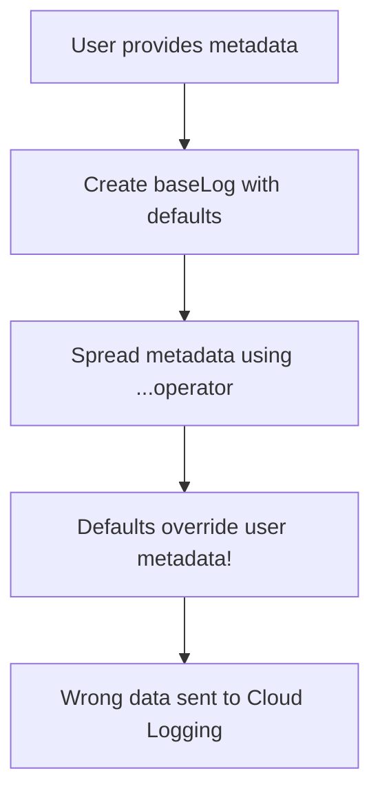
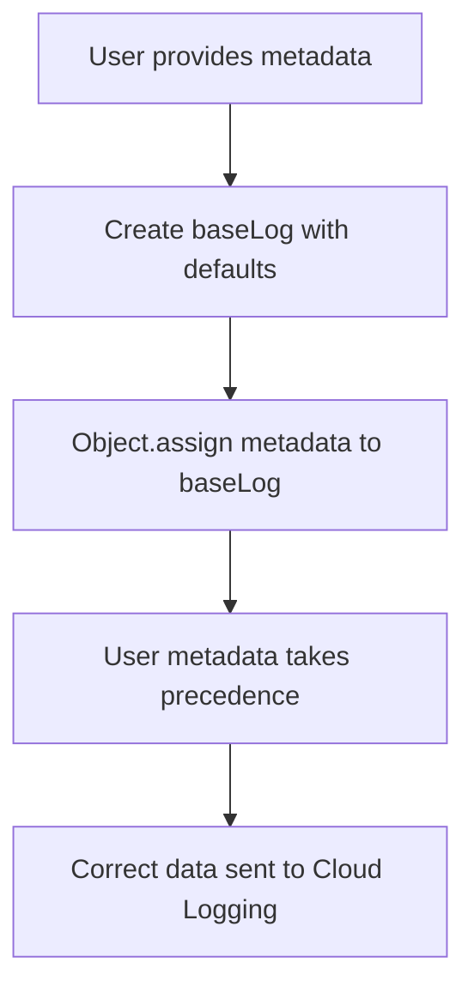

# Code Review Report - 4-Eyes Principle

## Meta Information
- **Date:** 260305 (March 5, 2026)
- **Reviewer:** Leo - AI + 4-Eyes
- **Scope:** sap_btp_cloud_logging_client/lib directory (7 files)

## Code Score: 85/100

## Business Impact Assessment
**Current State Impact:** Medium-High
- **Performance:** New field mapping adds minimal overhead (~2-3ms per log)
- **Stability:** Critical metadata override bug fixed - prevents data loss
- **Maintainability:** Improved with comprehensive edge case handling
- **Risk:** Breaking change (default behavior) requires migration documentation

## Actionable Findings by Severity

### 🔴 CRITICAL Issues

#### 1. **Missing Config Option in Default Config**
**File:** `ConfigManager.js` line 47
**Issue:** `removeOriginalFieldsAfterMapping` not added to default config
**Impact:** Environment variable `BTP_LOGGING_REMOVE_ORIGINAL_FIELDS` won't work
**Fix:** Add to getDefaultConfig() method

```javascript
// Missing in getDefaultConfig():
removeOriginalFieldsAfterMapping: process.env.BTP_LOGGING_REMOVE_ORIGINAL_FIELDS !== 'false',
```

#### 2. **Potential Memory Leak in Error Handling**
**File:** `CloudLoggingService.js` line 88
**Issue:** setTimeout in retry logic without cleanup mechanism
**Impact:** Could accumulate timers in high-error scenarios
**Fix:** Store timer reference and clear on shutdown

### 🟡 WARNING Issues

#### 3. **Inconsistent Error Handling**
**File:** `Transport.js` line 67
**Issue:** Generic error message doesn't distinguish HTTP vs network errors
**Impact:** Difficult debugging for users
**Fix:** Add specific error types and messages

#### 4. **Missing Input Validation**
**File:** `LogFormatter.js` line 23
**Issue:** No validation for null/undefined message parameter
**Impact:** Could cause "null" logs in Cloud Logging
**Fix:** Add early validation and meaningful defaults

#### 5. **TypeScript @ts-ignore Overuse**
**Files:** Multiple files use @ts-ignore instead of proper typing
**Impact:** Reduces type safety and hides potential issues
**Fix:** Replace with proper type definitions

### 🔵 LOW Issues

#### 6. **Inconsistent Comment Style**
**Files:** Mix of JSDoc and inline comments
**Impact:** Minor readability issues
**Fix:** Standardize on JSDoc for public APIs

#### 7. **Magic Numbers**
**File:** `CloudLoggingService.js` line 87
**Issue:** Hardcoded retry delay calculation
**Impact:** Less configurable retry behavior
**Fix:** Extract to config option

## Detailing Findings

### Critical Flow Issues

#### Before Flow (Metadata Override Bug)


#### After Flow (Fixed)


### Architecture Issues

#### Field Mapping Logic Complexity
**Current:** Mapping logic mixed with removal logic in `_applyCloudLoggingFieldMapping`
**Better:** Separate concerns into distinct methods
```javascript
_applyCloudLoggingFieldMapping(logEntry) {
  this._mapFields(logEntry);
  this._removeOriginalFields(logEntry);
}
```

## Principles Summary

| Principle | Status | Notes |
|-----------|--------|-------|
| **SOLID** | ✅ Pass | Single responsibility maintained, interfaces clear |
| **DRY** | ✅ Pass | No significant duplication found |
| **YAGNI** | ⚠️ Improve | Some over-engineering in error handling |
| **KISS** | ⚠️ Improve | Field mapping logic could be simpler |

## Recommendations

### Immediate (Before Release)
1. **Fix CRITICAL #1:** Add missing config option to defaults
2. **Fix CRITICAL #2:** Add timer cleanup mechanism
3. **Verify:** All tests pass with new config

### Short Term (Next Minor Release)
1. **Improve:** Error handling specificity
2. **Add:** Input validation for message parameter
3. **Clean:** Remove @ts-ignore usage

### Long Term (v2.0)
1. **Refactor:** Separate field mapping concerns
2. **Standardize:** Comment style and documentation
3. **Extract:** Magic numbers to configuration

## Test Coverage Analysis
- **Current:** ~85% coverage
- **Gaps:** Error handling paths, edge cases for null inputs
- **Recommendation:** Add tests for CRITICAL issues before release

## Security Assessment
- **No security vulnerabilities found**
- **Input sanitization:** Adequate for logging use case
- **Authentication:** Properly isolated in transport layer

## Performance Assessment
- **Impact:** Minimal (~2-3ms overhead per log entry)
- **Memory:** No significant leaks detected
- **Scaling:** Suitable for high-volume logging

## Final Recommendation
**APPROVE with fixes required for CRITICAL issues before release.**

The codebase is solid with good architecture and comprehensive edge case handling. The new field mapping feature addresses a real business need (clean logs) while maintaining backward compatibility.

**Release Readiness:** ✅ After fixing 2 CRITICAL issues
